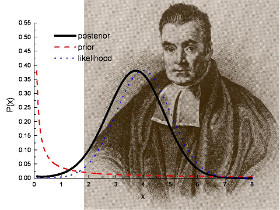
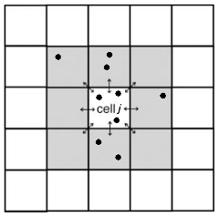

```{r setup, include=FALSE}
library(knitr)
knitr::opts_chunk$set(
	echo=TRUE,
	message=FALSE,
	warning=FALSE,
	cache=TRUE
)
knitr::opts_knit$set(
  root.dir=rprojroot::find_rstudio_root_file()
)
```

## Introduction

```{r causes, echo=FALSE, fig.cap="(ref:cap-causes)", out.width="\\textwidth"}
knitr::include_graphics("training/figures/causes.jpg")
```

Figure caption: **Main causes of deforestation in central Menabe.** **a-a'**: _Slash-and-burn agriculture ("hatsake") for peanut crop._ Peanut (a') is cultivated as a cash crop. Part of the production is at the destination of the national market but most of it is exported outside Madagascar, mainly for the Chinese market. **b-b'**: _Slash-and-burn agriculture for maize crop._ maize (b') is cultivated for auto-consumption and as a cash crop. The production of maize is at the destination of the national market and is used in particular to brew the national beers. **c-c'**: _Cyclone followed by uncontrolled fires._ Cyclone _"Fanele"_ (2009) caused tree mortality and accumulation of wood fuel on the ground. As a consequence, uncontrolled fires set on nearby pastures (c') spread over large areas of forest after 2009. **d-d'**: _Illegal logging._ Timbers are used for house and boat construction.

```{r cc-license, echo=FALSE}
knitr::include_graphics("training/figures/by-sa.png")
```

This tutorial is licensed under the [Creative Commons Attribution-ShareAlike 4.0 International License](http://creativecommons.org/licenses/by-sa/4.0/).

## Computing environment

### Installing Docker

Docker is used to run software packages called "containers". Containers are isolated from each other and bundle their own tools, libraries and configuration files. Containers are created from "images" that specify their precise contents.

To install Docker for your operating system, go to <https://docs.docker.com/install/>. For Windows user, go directly to <https://docs.docker.com/docker-for-windows/install/>.

### Docker image

For our tutorial, we have built a specific Docker image including R and Python:

- R computing environment: R 3.5.1, RStudio, and various R packages (ex. knitr, ggplot2, reticulate).
- Python computing environment: Python 3, and various Python packages (ex. numpy, pandas, matplotlib, and forestatrisk).

Some computations, such as computation by blocks on large raster files, were more easily coded and faster with Python. That's why we decided to use Python as a complementary language to R. The `reticulate` R package allow us to use Python functions from R and thus to work in a single computing environment within RStudio.

### Load the `forestatrisk` Docker image

Download the image from internet with the following command in a terminal: `docker pull ghislainv/docker-forestatrisk .` (do not forget the final ".")

Note: If the internet connection is slow, use a USB key and copy the image somewhere on your computer and load it with the following command: `docker load -i <path to image tar file>`

Run the container with `docker run -d -e PASSWORD=PWD -p 8787:8787 -v ORIGIN_FOLDER:/home/rstudio ghislainv/docker-forestatrisk`.  

Note:

- Set your own password `PWD`, it cannot be `rstudio`.
- Replace `ORIGIN_FOLDER` with a folder on your local machine where you want to save the R scripts. For example `/c/Users/YOUR_NAME` or `/home/YOUR_NAME`.

Point your browser to `localhost:8787` to access RStudio interface. Log in with `rstudio/PWD`.

### Get the tutorial

In RStudio, open a terminal and clone the GitHub repository locally:  
`git clone https://github.com/ghislainv/forecasting-deforestation-Mada`

Navigate with RStudio in the folder named `forecasting-deforestation-Mada` and open the R Notebook file named `training.Rmd`. R Markdown files (`*.Rmd`) can be used in R to embbed text, code, table and figues inside a unique document. Code are organized into 'chunks' that can be executed independently and interactively. An R Notebook is an R Markdown document with output visible immediately beneath the input. 

I used this notebook to write the tutorial available at <https://ecology.ghislainv.fr/forecasting-deforestation-Mada>.

In the preambule, change the author and date with your name and today's date.

### Loading libraries in R

```{r R_libraries}
# Environmental variables
Sys.unsetenv("DISPLAY") # Remove DISPLAY for Python plot

# Libraries
require(reticulate)
require(glue)
require(curl)
require(dplyr)
require(broom)
require(ggplot2)
require(rasterVis)
require(rgdal)

# Source R plotting functions
source("R/dfp_plot.R")
```

### Importing Python modules in R

Specify the Python version to use and check that it is the right one.

```{r}
use_python("/usr/bin/python3.5")
py_config()
```

Import the Python modules into R.

```{r importpy}
far <- import("forestatrisk")
patsy <- import("patsy")
sm <- import("statsmodels.api")
smf <- import("statsmodels.formula.api")

```

## Preparing the data-set

### Downloading the geospatial data

To model the spatial probability of deforestation, we need a map of the past deforestation and maps of potential explicative environmental variables. Environmental variables can be derived from topography (altitude and slope), accessibility (distance to roads, towns, and forest edge), deforestation history (distance to previous deforestation) or landscape policy (protected area network) for example. In our example, we use the following variables :

```{r variables}
library(kableExtra)
tab1 <- read.table("training/tables/variables.txt",sep=",",header=TRUE)
names(tab1) <- c("Product","Source","Variable derived","Unit","Resolution (m)")
# Kable
knitr::kable(tab1, linesep="") %>%
  kable_styling(bootstrap_options = c("striped"))
```

1. <http://bioscenemada.cirad.fr>, deforestation maps from @Vieilledent2018
2. <http://srtm.csi.cgiar.org>, SRTM 90m Digital Elevation Database v4.1
3. <http://www.geofabrik.de>, data extracts from the OpenStreetMap project for Madagascar,
4. <http://rebioma.net>, SAPM ("Système des Aires Protégées à Madagascar"), 20/12/2010 version


```{r download_data}
# Make data directory
if (!dir.exists("data")) {
  dir.create("data")
  dir.create("data/model")
  dir.create("data/mada")
  dir.create("data/validation")
}

# Files
files <- c("fordefor2010.tif", "dist_edge.tif", "dist_defor.tif",
           "altitude.tif", "slope.tif", "aspect.tif",
           "dist_road.tif", "dist_town.tif", "dist_river.tif",
           "sapm.tif", "roads.kml", "towns.kml", "rivers.kml", "sapm.kml")

# Download model data
for (i in files) {
  if (!file.exists(glue("data/model/{i}"))) {
    f <- glue("https://zenodo.org/record/259582/files/{i}")
    curl_download(f, glue("data/model/{i}"), quiet=FALSE)
  }
}

# Download validation data
if (!file.exists("data/validation/for2017.tif")) {
  f <- "http://bioscenemada.cirad.fr/FileTransfer/for2017.tif"
  curl_download(f, "data/validation/for2017.tif", quiet=FALSE)
}

# Download mada outline
if (!file.exists("data/mada/mada38s.shp")) {
  f <- "http://bioscenemada.cirad.fr/FileTransfer/mada38s.zip"
  curl_download(f, "data/mada/mada38s.zip", quiet=FALSE)
  unzip("data/mada/mada38s.zip", exdir="data/mada")
}

```

### Sampling points

We use the function `.sample()` from the `forestatrisk` module to sample 10,000 points (pixel centers) in the deforested areas and in the remaining forest (20,000 points in total). The `input_forest_raster` argument defines the path to the forest raster including the deforested pixels (with value=0) and the remaining forest pixels (value=1) after a given period of time. The random seed can be set with argument `Seed` to reproduce the data of the random sampling.

The `.sample()` function also extracts information from environmental variables for each sampled point. Sampling is done by block to allow the computation on large study areas (e.g. country or continental scale) with a fine spatial resolution (e.g. 30m). The `var_dir` argument indicates the directory including all the environmental raster files (they must be GeoTIFF files with extension `.tif`) that we want to test.

The `.sample()` function identifies the spatial cell for each sample point (sample point are grouped within a spatial cell). Spatial cells and grouped observations are used to estimate the spatial autocorrelation of the deforestation process. The `csize` argument define the width (in km) of the square spatial cells. Each spatial cell will be attributed a parameter. To avoid estimating too many parameters, width of the square spatial cells must be sufficiently large. Both points sampling and extraction of environmental data are done by block to avoid memory problems for big datasets.

```{r sampling}
# Make output directory
if (!dir.exists("output")) {
  dir.create("output")
}

# Training data-set
if (!file.exists("output/sample.txt")) {
  samp <- far$sample(nsamp=10000L, Seed=1234L, csize=10L,
                     var_dir="data/model",
                     input_forest_raster="fordefor2010.tif",
                     output_file="output/sample.txt",
                     blk_rows=1L)
}
samp <- read.table("output/sample.txt", header=TRUE, sep=",")
set.seed(1234)
train <- sample(1:20000, size=10000, replace=FALSE)
data_train <- samp[train,] %>% dplyr::filter(complete.cases(.))
data_valid <- samp[-train,] %>% dplyr::filter(complete.cases(.))
head(data_train)

```

## Deforestation model

We propose to use the **Binomial iCAR** model [@Vieilledent2014] to estimate the deforestation probability of a pixel given a set of environmental variables. The Binomial iCAR model is a linear Binomial logistic regression model including an intrinsic Conditional Autoregressive (iCAR) process to account for the spatial autocorrelation of the observations. Parameter inference is done in a hierarchical Bayesian framework. The `.model_binomial_iCAR()` function from the `forestatrisk` module includes a Metropolis-within-Gibbs algorithm written in pure C code to reduce computation time.



**Figure caption:** Parameter inference is done in a hierarchical Bayesian framework, which relies on the [Bayes' theorem](https://en.wikipedia.org/wiki/Bayes'_theorem) named after [Reverend Thomas Bayes](https://en.wikipedia.org/wiki/Thomas_Bayes). Each parameter has a prior and an approximated posterior probability distribution from which we can compute the mean, standard deviation, credible intervals at 95%, etc.

For the deforestation process it is _**very important to take into account the spatial autocorrelation of the process**_ with spatial random effects. Indeed, the selected fixed environmental variables are not able to fully explain the spatial variability of the deforestation process, especially when working at large geographical scales, such as the national or continental scale. Spatial random effects allow estimating a higher/lower probability of deforestation in a particular region (associated to **unmeasurable** or **unknow** factors) that is different from the mean probability of deforestation derived from the environmental factors included in the model. The Binomial iCAR model can be described as follow:

**Ecological process**

\begin{equation}
y_i \sim \mathcal{B}inomial(\theta_i,t_i) \\
\text{logit}(\theta_i) = X_i \beta + \rho_{j(i)}
\end{equation}

$y_i$: random variable for the deforestation process (0 if no deforestation, 1 if deforestation)

$\theta_i$: probability of deforestation

$t_i$: number of trials (always 1 in our example)

$X_i$: vector of values for environmental explicative variables

$\beta$: vector of fixed effect parameters

$\rho_j$: spatial random effect
  
$j(i)$: index of the spatial entity for observation $i$.
  
**Spatial autocorrelation**
  
The spatial autocorrelation is modelled with an intrinsic conditional autoregressive (iCAR) process:

\begin{equation}
\rho_j \sim \mathcal{N}ormal(\mu_j,V_{\rho} / n_j)
\end{equation}

$\mu_j$: mean of $\rho_{j'}$ in the neighborhood of $j$.
  
$V_{\rho}$: variance of the spatial random effects.
  
$n_j$: number of neighbors for spatial entity $j$.



**Figure caption:** Representation of the neighborhood for the intrinsic conditional autoregressive (iCAR) process. Target spatial cell $j$ has 8 neighbors in this case. Several observations (black points, equivalent to pixel centers in our case) can be located in each spatial cell. Deforestation probability in one spatial cell $j$ depends on deforestation probability in neighboring cells.

### Spatial cells

Before running the model, we add a column indicating the number of trials for each observation (1 in our case as we are considering a Bernoulli process). We then remove any observation with non-available data (NA) from the data-set. We also compute the number of neighbors (`nneigh`) and the neighbor identifiers (`adj`) for each spatial cell using function `.cellneigh` from the `forestatrisk` module.

```{r spatial_cells}
# Spatial cells for spatial-autocorrelation
neighborhood <- far$cellneigh_ctry(raster="data/model/fordefor2010.tif",
                                   vector="data/mada/mada38s.shp",
                                   csize=10L, rank=1L)
nneigh <- neighborhood[[1]]
adj <- neighborhood[[2]]
cell_in <- neighborhood[[3]]
ncell <- neighborhood[[4]]

# Udpate cell number in dataset
cell_rank <- vector()
for (i in 1:nrow(data_train)) {
  cell_rank[i] <- which(cell_in==data_train$cell[i])-1 # ! cells start at zero
}
data_train$cell <- cell_rank

```

### Model formula

A model formula must also be defined to specify the explicative variables we want to include in the model. The formula allows specifying some variable transformations (such as standardization in our case). See the [`patsy`](https://patsy.readthedocs.io/en/latest/) module for more information. In our model, we included the following variables: location inside a protected area, altitude, distance to past deforestation (with a degree two polynomial), distance to forest edge, distance to nearest road and distance to nearest town. The formula must end with the name of the variable indicating the spatial cell for each observation (`cell` in our case).

```{r formula}
# Formula
data_train$trials <- 1  # Set number of trials to one
formula <- paste0("I(1-fordefor2010) + trials ~ C(sapm) + scale(altitude) + scale(slope) +",
                  "scale(dist_defor) + np.power(scale(dist_defor),2) + ",
                  "scale(dist_edge) + ",
                  "scale(dist_road) + scale(dist_town) + cell")


```

### Fitting model parameters

```{r model}
# Model
mod_binomial_iCAR <- far$model_binomial_iCAR(
  # Observations
  suitability_formula=formula, data=data_train,
  # Spatial structure
  n_neighbors=np_array(nneigh,dtype="int32"), neighbors=np_array(adj,dtype="int32"),
  # Environment
  eval_env=-1L,
  # Chains
  burnin=1000L, mcmc=1000L, thin=1L,
  # Starting values
  beta_start=-99)

```

### Model summary

Once the model has been fitted, we can print a summary of the model showing the parameter estimates. The 95% credible intervals obtained from the posterior distribution of each parameter, except distance to nearest town (`dist_town`), do not include zero, indicating that parameters are significantly different from zero. The variance of the spatial random effects (`Vrho`) is given together with the deviance value, which can be used to compare different statistical models (lower deviance is better). Looking at the parameter estimates, we can see that the deforestation probability is much lower inside protected areas and that deforestation probability decreases with altitude, slope, distance to past deforestation, forest edge, roads and towns. Parameter values are then coherent regarding the deforestation process and easy to interpret.

```{r}
sink(file="output/summary_mod_binomial_iCAR.txt")
print(mod_binomial_iCAR)
sink()
print(mod_binomial_iCAR)
```

### Plot traces and posteriors

To check for the convergence of the Markov chain Monte Carlo (MCMC), we can plot the traces and the posterior distributions of the estimated parameters using method `.plot()` associated to the `hSDM_binomial_iCAR` class defined in the `deforestprob` module. This method returns the figures showing the traces and posterior distributions.

```{r plot_with_py, echo=FALSE}
traces_fig <- mod_binomial_iCAR$plot(output_file="output/mcmc.pdf",
                                     plots_per_page=3L,
                                     figsize=c(9,6),
                                     dpi=100)
```

```{r plot_with_r}
require(coda)
mcmc <- as.mcmc(mod_binomial_iCAR$mcmc)
plot(mcmc[,c(1:3,10,11)])
```

## Forecasting deforestation

### Resampling the spatial random effects

We use the model to predict the spatial probability of deforestation at the national scale for Madagascar. Before, doing so, we smooth the spatial random effects which have been estimated at a coarse resolution (10km in our example). To do so, we use the function `.resample_rho()` from the `deforestprob` module to resample the results at a finer resolution using a bilinear interpolation. The function writes a raster file to the disk with a resolution of the raster specified in the argument `input_raster` of the function (1km in our case). The function `.resample_rho()` returns a figure of the spatial random effects that can be plotted.

```{r rho, fig.height=7, message=FALSE, warning=FALSE}
# Get the spatial random effects
rho <- rep(-9999,ncell)  # -9999 will be considered as nodata
rho[cell_in+1] <- mod_binomial_iCAR$rho

# Resample them
far$resample_rho(rho=r_to_py(rho), input_raster="data/model/fordefor2010.tif",
                 output_file="output/rho.tif",
                 csize_orig=10L, csize_new=1L)

# Plot random effects
far$plot$rho("output/rho_orig.tif",output_file="output/rho_orig.png")
far$plot$rho("output/rho.tif",output_file="output/rho.png")

# Plot with R
mada <- rgdal::readOGR(dsn="data/mada",layer="mada38s")
r.rho_orig <- raster("output/rho_orig.tif")
r.rho <- raster("output/rho.tif")
rho_plot(r.rho_orig, mada, output_file="output/rho_orig_ggplot.png",
         quantiles_legend=c(0.025,0.975),width=4.5, height=8)
rho_plot(r.rho, mada, output_file="output/rho_ggplot.png",
         quantiles_legend=c(0.025,0.975),width=4.5, height=8)

```

### Computing spatial probability of deforestation

The `.predict_raster_binomial_iCAR()` function of the `forestatrisk` module can be used to predict the spatial probability of deforestation from an **hSDM_binomial_iCAR** model (i.e. an object of class `hSDM_binomial_iCAR`). The function writes a raster of predictions to the disk. The prediction is done by block to avoid memory problems for big datasets. Functions will return NA for pixels with no forest or for pixels with missing environmental variables.

```{r compute_predictions}
far$predict_raster_binomial_iCAR(mod_binomial_iCAR, var_dir="data/model",
                                 input_cell_raster="output/rho.tif",
                                 input_forest_raster="data/model/fordefor2010.tif",
                                 output_file="output/pred_binomial_iCAR.tif",
                                 blk_rows=128L)

```

The raster of predictions can then be plotted.

```{r plot_predictions}
far$plot$prob("output/pred_binomial_iCAR.tif",output_file="output/pred_binomial_iCAR.png")

```

### Predicting future forest cover

Given the spatial probability of deforestation and the number of hectares that should be deforested, we can predict the future forest cover using function `.deforest()` from the `forestatrisk` package. The number of hectares are converted into number of pixels to be deforested. Pixels with the highest probability of deforestation are deforested first. The function computes a probability threshold above which pixels are deforested.

In our example, we consider an annual deforestation of roughly 100,000 ha for Madagascar. Considering the period 2010-2050, this would correspond to 4 Mha of deforestation. This number can of course be more precise and refined considering various deforestation scenarios (demographic growth, economic development, etc.).

```{r compute_future_forest_cover}
deforest <- far$deforest(input_raster="output/pred_binomial_iCAR.tif",
                         hectares=4000000,
                         output_file="output/forest_cover_2050.tif",
                         blk_rows=128L)

```

We can plot the predicted future forest cover in 2050. The red areas represent the deforestation on the period 2010-2050. The green areas represent the remaining forest in 2050. Most of the remaining forest in 2050 are inside the protected areas or located in remote areas, at high altitudes and far from roads and big cities (for example in the Tsaratanana mountain region and around the Masoala peninsula, north-east Madagascar).

```{r plot_future_forest_cover}
far$plot$fcc("output/forest_cover_2050.tif",output_file="output/forest_cover_2050.png")

```

## References